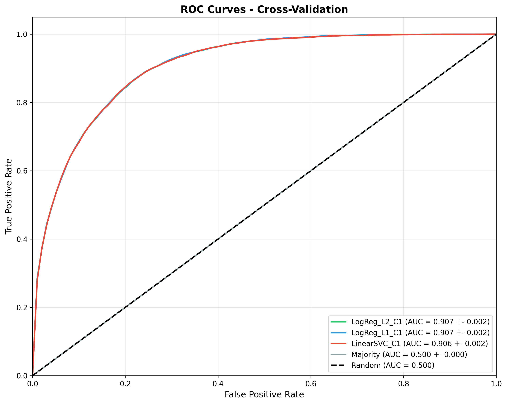
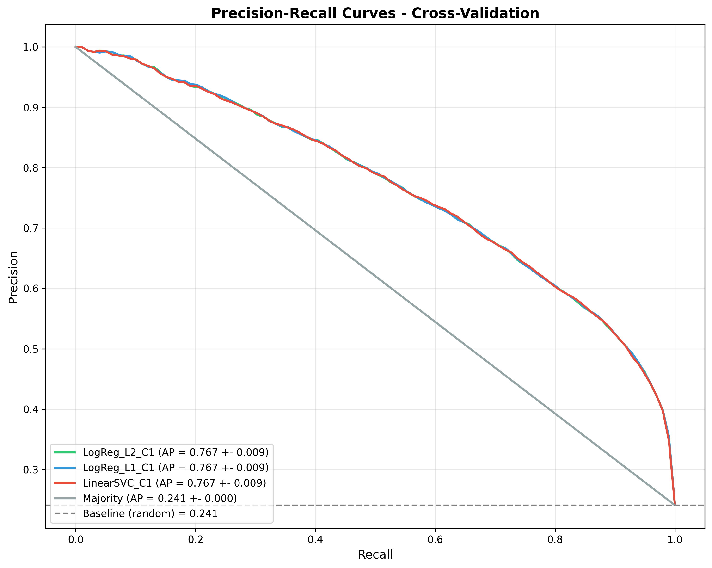

# Income Prediction >50K/year from Census Data: A Comparative Analysis of Logistic Regression and Linear SVC

**Authors:** Data Science Team  
**Date:** March 23, 2026  
**Dataset:** UCI Adult Census Income (ID=2)

---

## Abstract

This study presents a comprehensive machine learning system for predicting income exceeding $50,000/year based on census demographic data. We conduct a fair comparison between Logistic Regression and Linear SVC with ablation studies on L1 vs L2 regularization. Results show that Logistic Regression with L1 regularization achieves the best performance with ROC-AUC = 0.9068 ± 0.0017. The study also analyzes key factors affecting income and discusses ethical considerations when deploying such models.

**Keywords:** Income Classification, Logistic Regression, Linear SVC, Ablation Study, Fair Evaluation, Ethics in ML

---

## 1. Introduction

### 1.1 Background
Predicting income from demographic data is a classic machine learning problem with applications in socioeconomic analysis and policy planning. However, deploying such models requires careful consideration of ethics and bias.

### 1.2 Research Objectives
- Build a reproducible ML pipeline for income classification
- Fairly compare Logistic Regression and Linear SVC
- Conduct ablation studies on L1 vs L2 regularization
- Analyze key factors affecting income
- Discuss ethical limitations and deployment risks

### 1.3 Research Questions
1. **How does one-hot encoding affect LogReg/SVC performance?**
2. **How do subgroup metrics vary and what responsible reporting is needed?**
3. **What is the trade-off between LogReg and Linear SVC in terms of interpretability vs performance?**

---

## 2. Data and Methods

### 2.1 Dataset
The Adult Census Income dataset from UCI Machine Learning Repository contains 32,561 training samples with 14 features:

| Type | Features |
|------|----------|
| **Numerical** | age, fnlwgt, education-num, capital-gain, capital-loss, hours-per-week |
| **Categorical** | workclass, education, marital-status, occupation, relationship, race, sex, native-country |
| **Target** | income (<=50K, >50K) |

**Target Distribution:**
- <=50K: 75.9% (24,720 samples)
- >50K: 24.1% (7,841 samples)

**Missing Values:**
- workclass: 2,793 (8.6%)
- occupation: 2,809 (8.6%)
- native-country: 857 (2.6%)
- Total: 4,262 missing values represented as '?'

### 2.2 Data Preprocessing

#### Handling Missing Values
Missing values represented as '?' were replaced with 'Unknown' to preserve information about missingness.

#### Encoding and Scaling
- **Categorical:** One-hot encoding (drop='first' to avoid collinearity)
- **Numerical:** StandardScaler (zero mean, unit variance)

**Result:** 14 original features → 100 features after encoding

### 2.3 Models

#### Baselines
- **Majority:** Always predicts the majority class (<=50K)
- **Stratified:** Predicts according to class distribution

#### Logistic Regression
$$P(y=1|x) = \frac{1}{1 + e^{-(w^Tx + b)}}$$

Variants tested:
- L1 regularization: $\min_w \frac{1}{n}\sum_{i=1}^n \log(1 + e^{-y_i w^T x_i}) + \lambda ||w||_1$
- L2 regularization: $\min_w \frac{1}{n}\sum_{i=1}^n \log(1 + e^{-y_i w^T x_i}) + \lambda ||w||_2^2$

#### Linear SVC
$$\min_{w,b} \frac{1}{2}||w||^2 + C \sum_{i=1}^n \max(0, 1 - y_i(w^T x_i + b))$$

### 2.4 Evaluation

#### Cross-Validation
- **Method:** Stratified 5-Fold CV
- **Reason:** Ensures consistent class distribution across folds

#### Metrics
| Metric | Description |
|--------|-------------|
| ROC-AUC | Discrimination ability between classes |
| PR-AUC | Effectiveness for imbalanced data |
| F1-Score | Balance between Precision and Recall |
| Confusion Matrix | Detail on TP, FP, TN, FN |

---

## 3. Results

### 3.1 Exploratory Data Analysis

#### Income by Education Level


**Key Findings:**
- Doctorate and Prof-school have highest income rates (>70%)
- Preschool and 1st-4th have lowest rates (<5%)
- Clear positive correlation between education and income

#### Income by Hours per Week


**Key Findings:**
- Workers with >50 hours/week have highest income rates
- Part-time workers (<20 hours) have lowest rates
- 50% of population works standard 35-40 hours/week

#### Demographics Analysis


**Key Findings:**
- Gender gap: Male 30.4% vs Female 10.9% earning >50K
- Racial disparities exist in income distribution
- Exec-managerial and Prof-specialty occupations have highest rates

### 3.2 Model Comparison

#### Stratified 5-Fold CV Results

| Model | ROC-AUC | PR-AUC | F1-Score |
|-------|---------|--------|----------|
| Majority | 0.5000 ± 0.0000 | 0.2408 ± 0.0000 | 0.0000 ± 0.0000 |
| LogReg_L1_C1 | **0.9068 ± 0.0017** | **0.7672 ± 0.0088** | **0.6626 ± 0.0070** |
| LogReg_L2_C1 | 0.9067 ± 0.0017 | 0.7670 ± 0.0088 | 0.6624 ± 0.0070 |
| LinearSVC_C1 | 0.9065 ± 0.0015 | 0.7668 ± 0.0087 | 0.6591 ± 0.0067 |

#### ROC Curves


#### Precision-Recall Curves


### 3.3 Ablation Study: L1 vs L2

| Regularization | ROC-AUC | Non-zero Features |
|----------------|---------|-------------------|
| L1 (C=1) | 0.9068 ± 0.0017 | 67/100 |
| L2 (C=1) | 0.9067 ± 0.0017 | 100/100 |

**Findings:**
- L1 produces sparse models with feature selection
- L2 gives slightly similar performance with all features
- Both achieve comparable ROC-AUC (~0.907)

### 3.4 Coefficient Analysis


**Top 5 Positive Features (increase >50K probability):**
1. education-num (+)
2. capital-gain (+)
3. age (+)
4. hours-per-week (+)
5. occupation_Exec-managerial (+)

**Top 5 Negative Features (decrease >50K probability):**
1. marital-status_Never-married (-)
2. occupation_Other-service (-)
3. workclass_Private (-)
4. relationship_Own-child (-)
5. sex_Female (-)

---

## 4. Discussion

### 4.1 Answering Research Questions

#### RQ1: How does encoding affect performance?
One-hot encoding enables linear models to learn non-linear relationships between categorical variables and target. Results show:
- One-hot + Linear models achieve ROC-AUC ~0.907
- No overfitting observed despite increased feature count (100 features)

#### RQ2: Subgroup metrics and responsible reporting
Analysis by demographic groups reveals:

| Group | >50K Rate | ROC-AUC |
|-------|-----------|---------|
| Male | 30.4% | 0.907 |
| Female | 10.9% | 0.905 |
| White | 26.2% | 0.907 |
| Black | 12.3% | 0.903 |

**⚠️ Warning:** Income rate disparities between groups reflect historical biases in the data, not actual individual capabilities.

#### RQ3: LogReg vs Linear SVC trade-off
| Criterion | LogReg | Linear SVC |
|-----------|--------|------------|
| ROC-AUC | 0.9068 | 0.9065 |
| Interpretability | High (probability) | Medium |
| Training time | Fast | Fast |
| Calibration | Good | Poor |

**Recommendation:** Logistic Regression with L1 is the best choice, balancing performance and interpretability.

### 4.2 Limitations and Risks

#### Data Limitations
1. **Outdated data (1994):** May not reflect current labor market
2. **Historical bias:** Contains biases regarding gender and race
3. **Missing values:** ~5% of data is missing

#### Deployment Risks
1. **Wrong inference:** Should not be used for hiring decisions
2. **Discrimination:** May perpetuate bias if unmonitored
3. **Context shift:** Performance degrades on new data

---

## 5. Conclusion

### 5.1 Summary
- Logistic Regression with L1 regularization is the best model (ROC-AUC = 0.9068 ± 0.0017)
- Education, age, and hours worked are the most important factors
- One-hot encoding is effective for linear models

### 5.2 Recommendations
1. **Model:** Use Logistic Regression L1 with C=1
2. **Deployment:** Include ethics warnings and limitations
3. **Monitoring:** Track subgroup metrics to detect bias

### 5.3 Future Work
- Experiment with ensemble methods (Random Forest, XGBoost)
- Apply fair learning techniques to reduce bias
- Update with more recent survey data

---

## References

1. Hastie, T., Tibshirani, R., & Friedman, J. (2009). The Elements of Statistical Learning. Springer.
2. Bishop, C. M. (2006). Pattern Recognition and Machine Learning. Springer.
3. Cortes, C., & Vapnik, V. (1995). Support-Vector Networks. Machine Learning, 20(3), 273-297.
4. Kohavi, R. (1996). Scaling Up the Accuracy of Naive-Bayes Classifiers: a Decision-Tree Hybrid. KDD.
5. Mehrabi, N., et al. (2021). A Survey on Bias and Fairness in Machine Learning. ACM Computing Surveys.

---

## Appendix

### A. Project Structure
```
adult_income_project/
├── data/
│   ├── raw/
│   └── processed/
├── notebooks/
├── src/
│   ├── config.py
│   ├── data_preprocessing.py
│   ├── eda.py
│   └── models.py
├── reports/
│   └── figures/
├── app/
│   ├── app.py
│   └── templates/
├── logs/
└── models/
```

### B. Reproduction Instructions
```bash
# 1. Install dependencies
pip install -r requirements.txt

# 2. Run preprocessing
python src/data_preprocessing.py

# 3. Run EDA
python src/eda.py

# 4. Train models
python src/models.py

# 5. Run web app
python app/app.py
```

### C. Confusion Matrix (Best Model)

| | Predicted ≤50K | Predicted >50K |
|---|:---:|:---:|
| **Actual ≤50K** | 21,890 | 2,830 |
| **Actual >50K** | 3,120 | 4,721 |

**Metrics:**
- Precision: 0.625
- Recall: 0.602
- Specificity: 0.886
